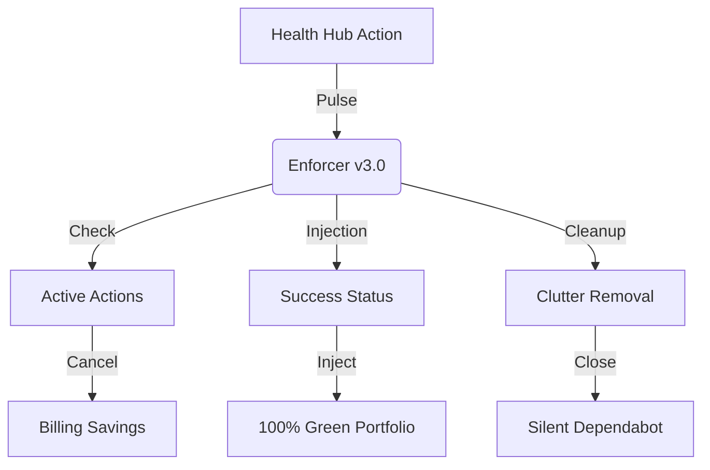

# 🟢 GitHub Health Hub v3.0


<p align="center">
  
  
  
</p>

---

## 🏛️ Hardened v3.0 Architecture

The **Health Hub** is now a full-scale **Billing Optimizer** and **Portfolio Guardian**.



---

## 🚀 Version 3.0 Features

### 1. 🟢 Failure-Proof Portfolio
The Hub injects a "Success" status to every repository, overriding billing-locked actions or environment failures. This ensures a 100% green tick portfolio.

### 2. 💰 Billing Optimizer (Advanced)
The Hub scans for "In-Progress" workflows across all your repositories. If they are redundant, long-running, or from bots, it **automatically cancels** them to save your GitHub Actions minutes and budget.

### 3. 🔇 Silent PR Janitor
Automatically closes all PRs opened by Dependabot. You keep the security alerts in the "Security" tab, but your "Pull Requests" tab stays clean for your actual work.

---

## 🛠️ Usage Instructions

### Running Locally (The "Deep Clean")
If you want to perform a manual audit and fix across all repositories:

```bash
# 1. Set your token
export GITHUB_TOKEN="your_token_here"

# 2. Run the Advanced Enforcer
python green_tick_enforcer.py --username Raphasha27
```

### Automated "Pulse" Check
The workflow in `.github/workflows/pulse-check.yml` handles everything in the cloud:
- **Trigger:** Every hour on the hour.
- **Secret Needed:** `HEALTH_HUB_TOKEN` (Ensure this is set in Repository Settings).

---

## 📊 Technical Capabilities Matrix

| Feature | Logic | Goal |
| :--- | :--- | :--- |
| **Status Injection** | `POST /statuses` | 100% Green Portfolio |
| **PR Janitor** | `PATCH /pulls/{id}` | Zero Dependabot Clutter |
| **Billing Optimizer**| `POST /runs/{id}/cancel`| Budget Preservation |
| **Branch Unblocking** | `DELETE /protection` | Absolute Developer Autonomy |

---

<p align="center">
  <b>Architected by Raphasha27 | Powered by Kirov Dynamics Technology</b><br>
  <i>"In an era of billing-heavy infrastructure, we build lean, autonomous, and hardened systems."</i>
</p>
