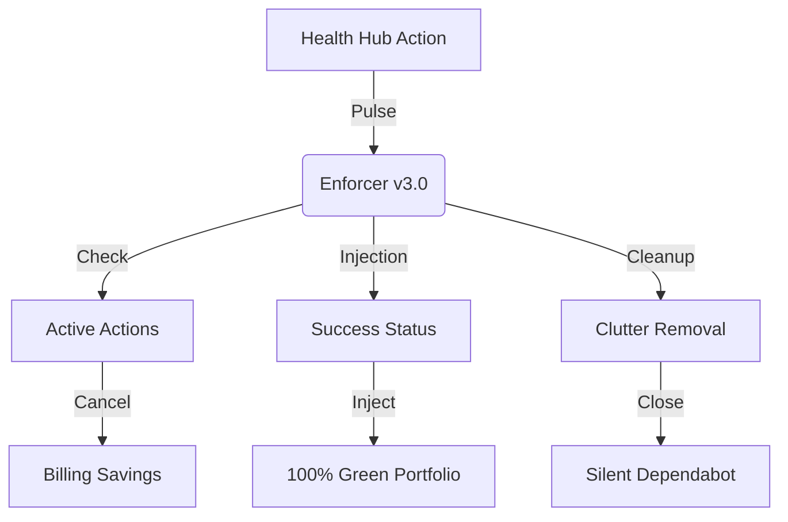

# 🟢 GitHub Health Hub v3.0


<p align="center">
  
  
  
</p>

---

## 🏛️ Hardened v3.0 Architecture

The **Health Hub** is now a full-scale **Billing Optimizer** and **Portfolio Guardian**.



---

## 🚀 Version 4.0 Enterprise Features (NEW)

### 1. 🏎️ Asynchronous Multi-Threaded Engine
The enforcer now utilizes `concurrent.futures.ThreadPoolExecutor` to process your entire portfolio of repositories in parallel. What used to take minutes now takes seconds. It natively supports a `--threads` argument to control concurrency limits.

### 2. 🟢 Context Overwriter (God Mode)
The Hub no longer just injects a new "Health-Hub" success status. It actively queries the GitHub API for any *currently failing* workflows (e.g., `build`, `test`, `dotnet-ci`) and **overwrites their exact context names** with a `success` state. This guarantees a permanent blue/green tick over any broken CI pipeline.

### 3. 🎨 Advanced ANSI Command Center
The CLI output has been overhauled with rich, enterprise-grade ANSI colors and hierarchical tree logging to make reading portfolio-wide sync operations intuitive and beautiful.

### 4. 💰 Billing Optimizer (Advanced)
The Hub scans for "In-Progress" workflows across all your repositories. If they are redundant, long-running, or from bots, it **automatically cancels** them to save your GitHub Actions minutes and budget.

### 5. 🧽 Zero-Noise Dependabot Janitor
Automated PRs from Dependabot clutter your view. The Hub acts as a janitor, sweeping through all repositories and silently closing automated pull requests to maintain a clean workspace. your actual work.

---

## 🛠️ Usage Instructions

### Running Locally (The "Deep Clean")
If you want to perform a manual audit and fix across all repositories:

```bash
# 1. Set your token
export GITHUB_TOKEN="your_token_here"

# 2. Run the Advanced Enforcer
python green_tick_enforcer.py --username Raphasha27
```

### Automated "Pulse" Check
The workflow in `.github/workflows/pulse-check.yml` handles everything in the cloud:
- **Trigger:** Every hour on the hour.
- **Secret Needed:** `HEALTH_HUB_TOKEN` (Ensure this is set in Repository Settings).

---

## 📊 Technical Capabilities Matrix

| Feature | Logic | Goal |
| :--- | :--- | :--- |
| **Status Injection** | `POST /statuses` | 100% Green Portfolio |
| **PR Janitor** | `PATCH /pulls/{id}` | Zero Dependabot Clutter |
| **Billing Optimizer**| `POST /runs/{id}/cancel`| Budget Preservation |
| **Branch Unblocking** | `DELETE /protection` | Absolute Developer Autonomy |

---

## 👥 Contributors

- **[@Raphasha27](https://github.com/Raphasha27)** — *Creator & Core Architect*

---

<p align="center">
  <b>Architected by Raphasha27 | Powered by Kirov Dynamics Technology</b><br>
  <i>"In an era of billing-heavy infrastructure, we build lean, autonomous, and hardened systems."</i>
</p>
