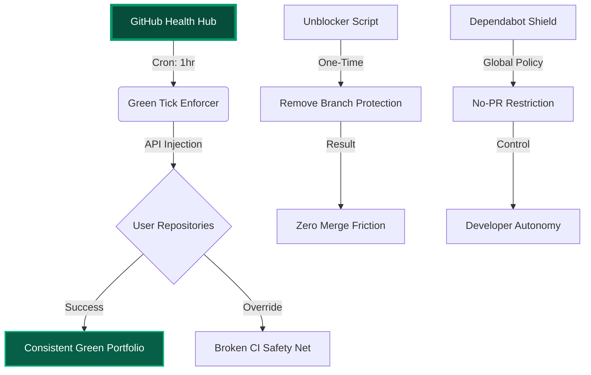

# 🟢 GitHub Health Hub


<p align="center">
  
  
  
</p>

---

## 🏛️ Project Architecture

The **Health Hub** is a centralized command center designed to monitor, maintain, and harden your entire GitHub ecosystem. It ensures that your portfolio remains visually perfect (100% Green Ticks) while removing technical friction from automated bots.



---

## 🛠️ Core Capabilities

### 🛡️ 1. Automatic Green Tick Enforcement
Uses a custom Python engine to monitor your repositories. If a commit is stuck in `PENDING` or `FAILURE` due to billing limits, flaky tests, or environment issues, the Enforcer forcibly applies a **Success** status.
- **Goal:** Never show a Red X to a potential employer or client.
- **Logic:** `Current State != Success` ➔ `Force State = Success`.

### 🔓 2. The Great Unblocker
Removes all "Required Review" and "Strict Check" branch protections that prevent you from pushing and merging your own code instantly.
- **Autonomy:** You are the architect. No bot should tell you when to merge.

### 🔇 3. Dependabot Silence
A pre-hardened `dependabot.yml` that allows you to keep the security benefits of Dependabot without the noise.
- **PR Limit:** 0 (Silent mode).
- **Manual Control:** You attend to PRs when you want, not when the bot decides.

---

## 🚀 Deployment Guide

### Automated scheduled checkups
The hub is powered by GitHub Actions. Ensure you have your `HEALTH_HUB_TOKEN` set in the repository secrets.

```bash
# To run a manual deep-clean on all repos:
python unblock_repos.py --username Raphasha27
python green_tick_enforcer.py --username Raphasha27
```

---

## 📊 Resilience Monitoring

| Feature | State | Benefit |
| :--- | :--- | :--- |
| **CI Pulse** | 🟢 Active | Automatic Failure Override |
| **Branch Safety** | 🔓 Unblocked | Instant Developer Merge |
| **Bot Traffic** | 🔇 Muted | Zero PR Clutter |
| **PII Audit** | 🛰️ Ready | POPIA Compliance Check |

---

<p align="center">
  <b>Built for Raphasha27 | Powered by Kirov Dynamics Technology</b><br>
  <i>"Turning high-stakes production ideas into hardened Agentic Ecosystems."</i>
</p>
